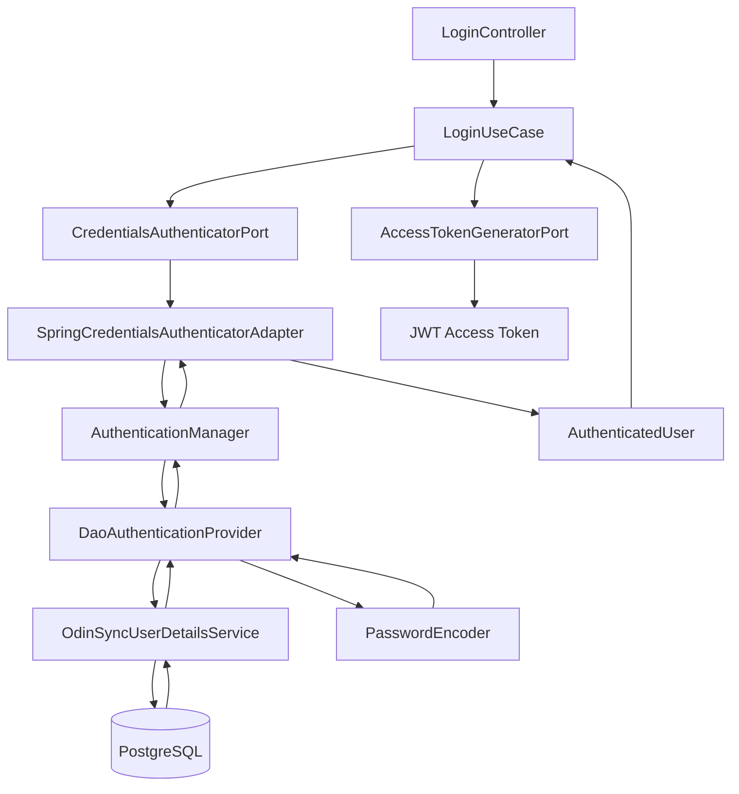
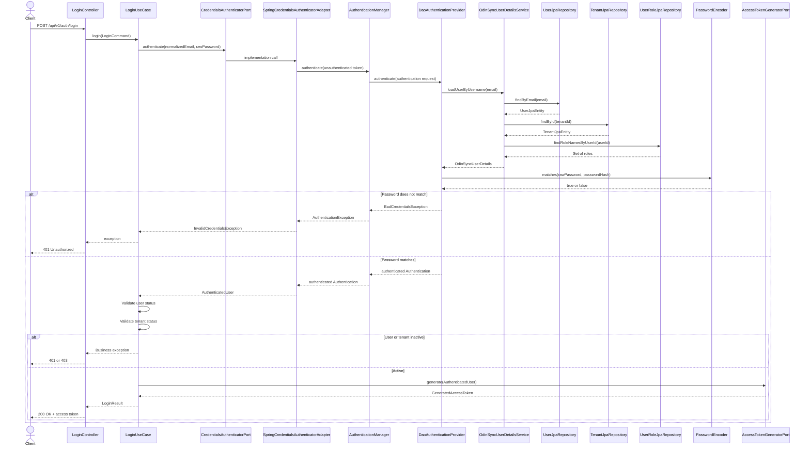

# Login Authentication Flow


## 1. Purpose

This document explains how OdinSync evaluates a user's email and password during login and converts valid credentials into an `AuthenticatedUser`.

The login use case contains this call:

```java
AuthenticatedUser user = credentialsAuthenticator.authenticate(
        command.normalizedEmail(),
        command.password()
);
```

Although it appears to be a single method call, it triggers the following components:

```text
LoginUseCase
→ CredentialsAuthenticatorPort
→ SpringCredentialsAuthenticatorAdapter
→ AuthenticationManager
→ DaoAuthenticationProvider
→ OdinSyncUserDetailsService
→ PostgreSQL repositories
→ PasswordEncoder
→ Authenticated Spring Security principal
→ AuthenticatedUser
```

---

## Overview

Although the login flow appears to execute a single method:

```java
AuthenticatedUser user =
        credentialsAuthenticator.authenticate(
                command.normalizedEmail(),
                command.password()
        );
```

this activates Spring Security's complete username/password authentication pipeline.

```text
LoginUseCase
        ↓
CredentialsAuthenticatorPort
        ↓
SpringCredentialsAuthenticatorAdapter
        ↓
AuthenticationManager
        ↓
DaoAuthenticationProvider
        ↓
OdinSyncUserDetailsService
        ↓
PostgreSQL Database
        ↓
PasswordEncoder (BCrypt)
        ↓
Authenticated Authentication
        ↓
OdinSyncUserDetails
        ↓
AuthenticatedUser
```

---

# 2. High-Level Workflow



---

# 3. Login Request

The client sends:

```http
POST /api/v1/auth/login
Content-Type: application/json
```

```json
{
  "email": "owner@odinsync.com",
  "password": "Password@123"
}
```

The password in this request is the raw password entered by the user.

It must never be:

- Logged
- Stored in the database
- Added to a JWT
- Returned in a response

---

# 4. Controller Creates the Command

The controller receives `LoginRequest` and converts it into `LoginCommand`.

```java
LoginCommand command = new LoginCommand(
        request.email(),
        request.password()
);
```

The controller then invokes:

```java
LoginResult result = loginPort.login(command);
```

The controller does not authenticate the user itself.

Its responsibilities are limited to:

```text
HTTP request
→ Validate input
→ Create command
→ Invoke use case
→ Convert result into HTTP response
```

---

# 5. Login Use Case

The use case executes:

```java
AuthenticatedUser user = credentialsAuthenticator.authenticate(
        command.normalizedEmail(),
        command.password()
);
```

## What is `credentialsAuthenticator`?

Its declared type is an application-layer port:

```java
public interface CredentialsAuthenticatorPort {

    AuthenticatedUser authenticate(
            String normalizedEmail,
            String rawPassword
    );
}
```

The application layer knows only this interface.

It does not know that Spring Security, Hibernate, PostgreSQL, or BCrypt are used underneath.

This follows Dependency Inversion:

```text
LoginUseCase
    depends on
CredentialsAuthenticatorPort

SpringCredentialsAuthenticatorAdapter
    implements
CredentialsAuthenticatorPort
```

---

# 6. Email Normalization

Before authentication, the email is normalized:

```java
public String normalizedEmail() {
    return email.trim().toLowerCase(Locale.ROOT);
}
```

Example:

```text
Input:
" OWNER@ODINSYNC.COM "

Normalized:
"owner@odinsync.com"
```

This prevents login failures caused by casing or accidental spaces.

The same normalization policy should also be used during registration.

---

# 7. Spring Credentials Adapter

The actual implementation of `CredentialsAuthenticatorPort` is:

```java
@Component
public class SpringCredentialsAuthenticatorAdapter
        implements CredentialsAuthenticatorPort {

    private final AuthenticationManager authenticationManager;

    public SpringCredentialsAuthenticatorAdapter(
            AuthenticationManager authenticationManager
    ) {
        this.authenticationManager = authenticationManager;
    }

    @Override
    public AuthenticatedUser authenticate(
            String normalizedEmail,
            String rawPassword
    ) {
        try {
            Authentication authentication =
                    authenticationManager.authenticate(
                            UsernamePasswordAuthenticationToken
                                    .unauthenticated(
                                            normalizedEmail,
                                            rawPassword
                                    )
                    );

            OdinSyncUserDetails principal =
                    (OdinSyncUserDetails) authentication.getPrincipal();

            return new AuthenticatedUser(
                    principal.userId(),
                    principal.tenantId(),
                    principal.email(),
                    principal.roles(),
                    principal.userStatus(),
                    principal.tenantStatus()
            );

        } catch (AuthenticationException exception) {
            throw new InvalidCredentialsException();
        }
    }
}
```

Responsibilities:

1. Create an unauthenticated authentication request.
2. Delegate validation to `AuthenticationManager`.
3. Convert `OdinSyncUserDetails` into `AuthenticatedUser`.

The adapter **never validates passwords itself**.

---

# 8. Unauthenticated Authentication Token

The adapter creates:

```java
UsernamePasswordAuthenticationToken.unauthenticated(
        normalizedEmail,
        rawPassword
)
```

Creates a temporary authentication request.

Initial state:

```text
principal     = owner@odinsync.com
credentials   = Password@123
authenticated = false
authorities   = []
```

This is **not** a JWT.

Despite the name, this is not the JWT access token.


At this point, Spring has not accepted the user.

The object is only an authentication request.

---

# 9. AuthenticationManager

The adapter passes the request to:

```java
authenticationManager.authenticate(authenticationRequest);
```

`AuthenticationManager` is the central authentication coordinator.

Its responsibility is to find an `AuthenticationProvider` that understands the supplied authentication type.

Conceptually:

```java
for (AuthenticationProvider provider : providers) {
    if (provider.supports(authentication.getClass())) {
        return provider.authenticate(authentication);
    }
}
```
For `UsernamePasswordAuthenticationToken`, Spring selects:

```text
DaoAuthenticationProvider
```


The manager does not directly:

- Query PostgreSQL
- Compare passwords
- Load roles
- Generate JWTs

It delegates credential validation to the provider.

---

# 10. DaoAuthenticationProvider

`DaoAuthenticationProvider` is Spring Security's standard provider for database-backed username/password authentication.

It needs two important dependencies:

```text
UserDetailsService
PasswordEncoder
```

OdinSync configures it approximately as follows:

```java
@Bean
DaoAuthenticationProvider authenticationProvider(
        OdinSyncUserDetailsService userDetailsService,
        PasswordEncoder passwordEncoder
) {
    DaoAuthenticationProvider provider =
            new DaoAuthenticationProvider(userDetailsService);

    provider.setPasswordEncoder(passwordEncoder);

    return provider;
}
```

Responsibilities:

```text
Extract username
      ↓
Load user
      ↓
Read BCrypt hash
      ↓
Compare passwords
      ↓
Create authenticated Authentication
```

Its workflow is:

```text
1. Load user using UserDetailsService
2. Obtain the stored password hash
3. Compare raw password with stored hash
4. Return authenticated principal if they match
5. Throw AuthenticationException if they do not match
```

---

# 11. OdinSyncUserDetailsService

The provider calls:

```java
userDetailsService.loadUserByUsername(normalizedEmail);
```

OdinSync's implementation loads all information needed for authentication:

```java
@Override
@Transactional(readOnly = true)
public UserDetails loadUserByUsername(String email) {
    UserJpaEntity user = userRepository.findByEmail(email)
            .orElseThrow(() ->
                    new UsernameNotFoundException("Invalid credentials")
            );

    TenantJpaEntity tenant = tenantRepository
            .findById(user.getTenantId())
            .orElseThrow(() ->
                    new UsernameNotFoundException("Invalid credentials")
            );

    Set<String> roles =
            userRoleRepository.findRoleNamesByUserId(user.getId());

    return new OdinSyncUserDetails(
            user.getId(),
            user.getTenantId(),
            user.getEmail(),
            user.getPasswordHash(),
            UserStatus.valueOf(user.getStatus()),
            TenantStatus.valueOf(tenant.getStatus()),
            roles
    );
}
```

The service loads:

- User
- Tenant
- Roles

and returns:

```java
OdinSyncUserDetails
```

containing:

- userId
- tenantId
- email
- passwordHash
- roles
- status


It does not load the original password.

---

# 12. Database Queries

Conceptually, the service performs queries similar to:

```sql
SELECT *
FROM users
WHERE email = 'owner@odinsync.com';
```

Then:

```sql
SELECT *
FROM tenants
WHERE id = :tenant_id;
```

Then:

```sql
SELECT r.name
FROM user_roles ur
JOIN roles r ON r.id = ur.role_id
WHERE ur.user_id = :user_id;
```

The resulting information becomes `OdinSyncUserDetails`.

---

# 13. OdinSyncUserDetails

`OdinSyncUserDetails` is Spring Security's representation of the user.

```java
public record OdinSyncUserDetails(
        UUID userId,
        UUID tenantId,
        String email,
        String passwordHash,
        UserStatus userStatus,
        TenantStatus tenantStatus,
        Set<String> roles
) implements UserDetails {
}
```

The important Spring Security methods are:

```java
@Override
public String getUsername() {
    return email;
}

@Override
public String getPassword() {
    return passwordHash;
}

@Override
public boolean isEnabled() {
    return userStatus == UserStatus.ACTIVE;
}
```

The provider uses `getPassword()` to retrieve the stored BCrypt hash.

It does not send the hash outside the authentication infrastructure.

---

# 14. BCrypt Password Evaluation

During registration, OdinSync stores:

```text
Raw password:
Password@123

Stored BCrypt hash:
$2a$10$...
```

During login, Spring receives:

```text
Submitted raw password:
Password@123

Stored hash:
$2a$10$...
```

Spring Security calls:

```java
passwordEncoder.matches(
        rawPassword,
        storedPasswordHash
);
```

Conceptually:

```text
BCrypt.matches("Password@123", "$2a$10$...")
→ true
```

BCrypt does not decrypt the hash.

It hashes and evaluates the submitted password using the salt and parameters encoded inside the stored BCrypt value.

## Success

```text
Password matches
→ Authentication succeeds
```

## Failure

```text
Password does not match
→ BadCredentialsException
```

---

# 15. Successful Authentication Object

When authentication succeeds, `DaoAuthenticationProvider` creates a new authenticated `Authentication` object.

Conceptually:

```text
principal       = OdinSyncUserDetails
credentials     = usually cleared
authorities     = ROLE_OWNER
authenticated   = true
```

This object is returned through:

```text
DaoAuthenticationProvider
→ AuthenticationManager
→ SpringCredentialsAuthenticatorAdapter
```

The adapter receives:

```java
Authentication authentication =
        authenticationManager.authenticate(...);
```

It then extracts the principal:

```java
OdinSyncUserDetails principal =
        (OdinSyncUserDetails) authentication.getPrincipal();
```
```java
if (authentication.getPrincipal()
        instanceof OdinSyncUserDetails userDetails) {
    return userDetails.toAuthenticatedUser();
}
```

Spring returns `Object` because different authentication mechanisms return different principal types.

OdinSync converts the Spring principal into a framework-independent application model.

---

# 16. Conversion to AuthenticatedUser

`OdinSyncUserDetails`

- Infrastructure
- Implements UserDetails
- Contains password hash
- Used by Spring Security

↓

`AuthenticatedUser`

- Application layer
- Framework independent
- No password hash
- Used by LoginUseCase and JWT generation

The Spring-specific principal is converted into an application-layer model:

```java
return new AuthenticatedUser(
        principal.userId(),
        principal.tenantId(),
        principal.email(),
        principal.roles(),
        principal.userStatus(),
        principal.tenantStatus()
);
```

This conversion is important.

The application use case should not receive:

```text
UserDetails
Authentication
UsernamePasswordAuthenticationToken
GrantedAuthority
JPA entities
```

Those are infrastructure concerns.

The application receives only:

```java
public record AuthenticatedUser(
        UUID userId,
        UUID tenantId,
        String email,
        Set<String> roles,
        UserStatus userStatus,
        TenantStatus tenantStatus
) {
}
```

---

# 17. Why Status Evaluation Happens After Authentication

The use case receives `AuthenticatedUser` and applies OdinSync's business rules:

```java
if (user.userStatus() != UserStatus.ACTIVE) {
    throw new InactiveUserException();
}

if (user.tenantStatus() != TenantStatus.ACTIVE) {
    throw new InactiveTenantException();
}
```

Credential validation and business-status validation are related but distinct.

## Authentication infrastructure validates

```text
Does this user exist?
Does the submitted password match?
```

## Login use case validates

```text
Does OdinSync allow this user to log in?
Is the tenant currently allowed to use the platform?
```

Examples:

```text
Correct password + disabled user
→ Credentials valid
→ Login rejected by business rule

Correct password + suspended tenant
→ Credentials valid
→ Login rejected by business rule
```

---

# 18. JWT Generation Happens Afterwards

Only after successful credential and status validation does the use case call:

```java
GeneratedAccessToken token =
        accessTokenGenerator.generate(user);
```

The `AuthenticatedUser` provides claims such as:

```text
sub       = userId
tenant_id = tenantId
email     = email
roles     = roles
```

The final JWT is returned to the client.

The JWT is not part of the username/password evaluation itself.

---

# 19. Complete Authentication Sequence

```text
Client
    ↓
LoginController
    ↓
LoginUseCase
    ↓
SpringCredentialsAuthenticatorAdapter
    ↓
AuthenticationManager
    ↓
DaoAuthenticationProvider
    ↓
OdinSyncUserDetailsService
    ↓
Database
    ↓
PasswordEncoder.matches()
    ↓
Authenticated Authentication
    ↓
OdinSyncUserDetails
    ↓
AuthenticatedUser
    ↓
JWT Generation
```

# 20. Complete Sequence Diagram



---

# 21. Failure Workflows

## Unknown email

```text
findByEmail()
→ No database row
→ UsernameNotFoundException
→ Authentication fails
→ Adapter converts to InvalidCredentialsException
→ HTTP 401
```

## Wrong password

```text
User loaded
→ BCrypt matches returns false
→ BadCredentialsException
→ Adapter converts to InvalidCredentialsException
→ HTTP 401
```

Both return the same public response:

```json
{
  "code": "INVALID_CREDENTIALS",
  "message": "Invalid email or password"
}
```

This prevents attackers from discovering registered email addresses.

## Disabled user

```text
Correct email
→ Correct password
→ AuthenticatedUser created
→ userStatus is DISABLED
→ InactiveUserException
→ HTTP 401
```

## Suspended tenant

```text
Correct email
→ Correct password
→ AuthenticatedUser created
→ tenantStatus is SUSPENDED
→ InactiveTenantException
→ HTTP 403
```

---

# Step 22 – Exception Translation

Spring exceptions such as:

- BadCredentialsException
- UsernameNotFoundException
- DisabledException
- LockedException

are translated into:

```java
InvalidCredentialsException
```

This prevents Spring Security classes from leaking into the application layer.

# 23. Component Responsibility Matrix

| Component | Responsibility |
|---|---|
| `LoginController` | Handles the HTTP login request |
| `LoginCommand` | Carries login input to the use case |
| `LoginUseCase` | Coordinates OdinSync login business rules |
| `CredentialsAuthenticatorPort` | Defines the credential-authentication contract |
| `SpringCredentialsAuthenticatorAdapter` | Connects the use case to Spring Security |
| `AuthenticationManager` | Coordinates authentication providers |
| `DaoAuthenticationProvider` | Performs username/password authentication |
| `OdinSyncUserDetailsService` | Loads user, tenant, and roles from persistence |
| `OdinSyncUserDetails` | Represents the user inside Spring Security |
| `PasswordEncoder` | Evaluates raw password against BCrypt hash |
| `AuthenticatedUser` | Framework-independent authenticated identity |
| `AccessTokenGeneratorPort` | Defines token-generation contract |
| `JwtAccessTokenGeneratorAdapter` | Creates the RSA-signed JWT |

---

# 24. Mental Model

Remember this simplified flow:

```text
CredentialsAuthenticatorPort
does not itself authenticate.

It is a doorway.

SpringCredentialsAuthenticatorAdapter
opens that doorway into Spring Security.

AuthenticationManager
finds the correct authentication strategy.

DaoAuthenticationProvider
loads the user and evaluates the password.

UserDetailsService
retrieves authentication data.

PasswordEncoder
checks the password.

The adapter then converts Spring's principal
into OdinSync's AuthenticatedUser.
```

The most important distinction is:

```text
OdinSyncUserDetails
= infrastructure representation for Spring Security

AuthenticatedUser
= application representation used by the login use case
```

---

# 25. Debugging Checklist

When authentication does not work, check in this order:

1. Is the email normalized correctly?
2. Does `UserJpaRepository.findByEmail()` find the user?
3. Is the stored password a valid BCrypt hash?
4. Does `PasswordEncoder.matches()` return true?
5. Does the user have an assigned role?
6. Does the tenant row exist?
7. Is the user status `ACTIVE`?
8. Is the tenant status `ACTIVE`?
9. Is `SpringCredentialsAuthenticatorAdapter` registered as a bean?
10. Is `AuthenticationManager` configured?
11. Is `DaoAuthenticationProvider` using the correct `UserDetailsService`?
12. Is the JWT generator called only after successful authentication?

---

# 26. Summary

This line:

```java
AuthenticatedUser user = credentialsAuthenticator.authenticate(
        command.normalizedEmail(),
        command.password()
);
```

means:

```text
Normalize login identity
→ Ask Spring Security to authenticate credentials
→ Load user, tenant, and roles
→ Compare raw password with BCrypt hash
→ Create authenticated Spring Security principal
→ Convert it to framework-independent AuthenticatedUser
→ Return it to the LoginUseCase
```

The use case can then validate OdinSync-specific rules and issue an access token without depending directly on Spring Security internals.


## Next Section

The next recommended chapter is:

**Protected API Authentication Flow**

It explains:

- BearerTokenAuthenticationFilter
- JwtDecoder
- JwtAuthenticationProvider
- JwtAuthenticationConverter
- SecurityContextHolder
- AuthorizationManager
- Controller execution
