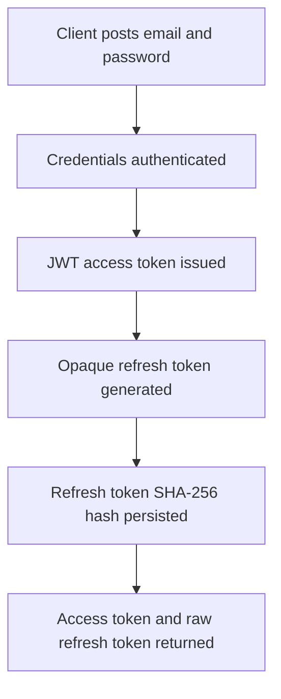
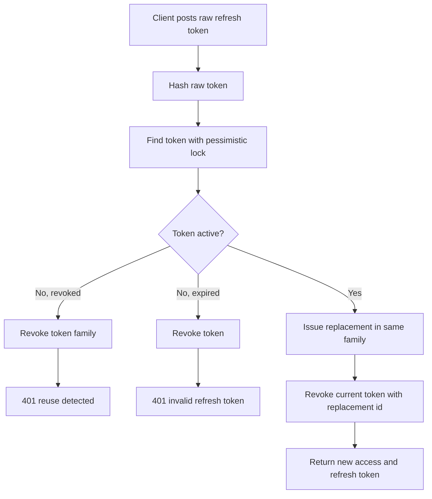

# Refresh-Token Rotation Flow

## Purpose

OdinSync uses short-lived JWT access tokens for protected APIs and long-lived opaque refresh tokens only at `POST /api/v1/auth/refresh`.

Refresh tokens are not JWTs. They are cryptographically random secrets, returned to the client once, and stored in the database only as SHA-256 hashes.

## Token Lifetimes

Defaults are configurable:

```yaml
odinsync:
  security:
    jwt:
      access-token-ttl: 15m
    refresh-token:
      ttl: 30d
      token-bytes: 64
```

## Login Flow



`POST /api/v1/auth/login` returns:

- `accessToken`
- `tokenType`
- `expiresIn`
- `refreshToken`
- `refreshTokenExpiresAt`
- `tenantId`
- `userId`
- `roles`

## Refresh Flow



The old refresh token becomes invalid immediately after a successful refresh.

## Reuse Detection

If a revoked refresh token is presented again, OdinSync treats it as possible token theft. The active tokens in the same `family_id` are revoked and the request returns:

```json
{
  "code": "REFRESH_TOKEN_REUSE_DETECTED",
  "message": "Refresh token reuse detected"
}
```

## Storage

The `refresh_tokens` table stores:

- token identity and tenant/user ownership
- SHA-256 `token_hash`
- `family_id`
- issuance and expiration timestamps
- revocation timestamp
- replacement token id
- audit timestamps

Raw refresh tokens are never stored.

## Postman Checks

1. Login with valid credentials and copy `refreshToken`.
2. Call `POST /api/v1/auth/refresh` with that token and expect a new token pair.
3. Reuse the first refresh token and expect `401` with `INVALID_REFRESH_TOKEN`.
4. Use the newest refresh token and expect `401` after the family has been revoked.
5. Call a protected API with the refreshed access token and expect authorization based on its JWT roles.

## Logout and Session Management

`POST /api/v1/auth/logout` accepts the current refresh token and revokes the full token family for that login session. The endpoint returns `204 No Content` and is intentionally idempotent.

`POST /api/v1/auth/logout-all` requires a valid access token and revokes active refresh-token sessions for the authenticated user in the current tenant only.

`GET /api/v1/auth/sessions` returns active session metadata without raw refresh tokens, token hashes, or persistence versions.

`DELETE /api/v1/auth/sessions/{sessionId}` revokes a selected session only when it belongs to the authenticated user and tenant.

## Operational Cleanup

OdinSync schedules cleanup with:

```yaml
odinsync:
  security:
    refresh-token:
      cleanup-cron: 0 30 2 * * *
      retention-period: 90d
```

Cleanup deletes only expired records that were already revoked and are older than the configured retention window.

## Current Limitations

- Refresh-token reuse detection can revoke known tokens in the same family, but it cannot identify a family when the submitted token hash is not found.
- Testcontainers-based database concurrency tests are not present in this repository yet.
- Centralized secret redaction, audit events, and Micrometer counters are not yet implemented as shared platform infrastructure.
